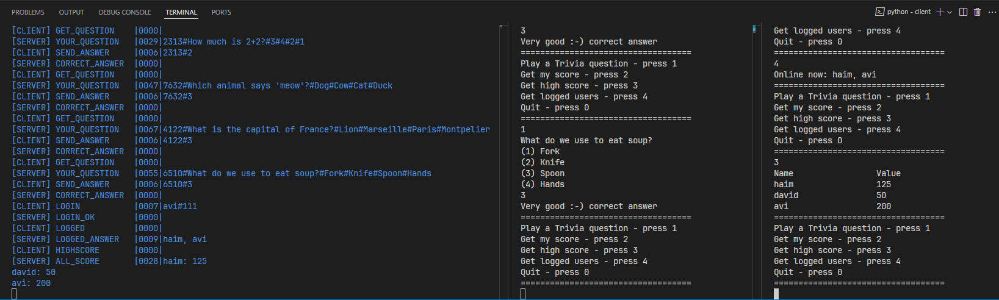

# 🧩 Trivia Game – Python TCP Client-Server App

A **multi-player trivia game** built with Python using raw TCP sockets and a custom messaging protocol.  
The game includes user login, real-time questions, scoring, and a dynamic high-score leaderboard.  
All communication is done via a custom text protocol using the `chatlib` module.

The game features a **console-based UI** that is clear, interactive, and enhanced with **colorful feedback** for a pleasant experience.

---

## 🧠 Features

- Multi-user TCP server with concurrent clients
- Structured client-server communication using custom protocol
- User login and logout
- Random question assignment from a pool of questions
- Answer validation and score tracking
- High score and personal score display
- Logged-in users listing
- Console interface with colorful feedback

---

## 🧰 Technologies Used

- 🐍 Python 3
- 🔌 TCP sockets
- 🧾 Custom text-based protocol
- 🧠 `select` for concurrent connections
- 🧱 Modular architecture for maintainability

---

## ⚙️ How It Works

- The server listens for incoming TCP connections and handles multiple clients using `select`.
- Both client and server communicate using a **custom message protocol** defined in `protocol/chatlib.py`, which formats commands and payloads.
- Users can:
  - Log in
  - Receive trivia questions
  - Send answers and receive immediate feedback
  - View their personal score
  - View the high score table
  - See who else is online

---

## 🧪 Sample Users (pre-loaded)

```json
{
	"haim": { "password": "111", "score": 100, "questions_asked": [] },
	"david": { "password": "111", "score": 50, "questions_asked": [] },
	"avi": { "password": "111", "score": 200, "questions_asked": [] }
}
```

---

## 🚀 How to Run Locally

```bash
# Clone the repository
git clone https://github.com/HaimHalfon/TriviaGame.git

# Navigate into the project folder
cd TriviaGame

# Install requirements
pip install -r requirements.txt
```

You need two terminals: one for the server and one for the client.

### 🖥️ Terminal 1 – Server

```bash
# Navigate to the server folder
cd server

# Start the server
python main.py
```

### 🖥️ Terminal 2 – Client

```bash
# Navigate to the client folder
cd client

# Start the client
python main.py
```

📡 **Note**: The server supports multiple clients connecting at the same time.
Just open additional terminals and run more clients concurrently.

---

## 📷 Screenshot


